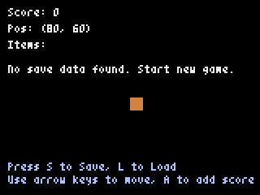

# Pyxel-Sandbox
[Pyxel](https://github.com/kitao/pyxel) 実験用プロジェクト

[HTML Pages](https://kitayoshi47.github.io/Pyxel-Sandbox/)

[スクリプト実行](https://kitao.github.io/pyxel/wasm/launcher/?run=kitayoshi47.Pyxel-Sandbox.sandbox.sandbox&gamepad=enabled)
[パッケージ実行](https://kitao.github.io/pyxel/wasm/launcher/?play=kitayoshi47.Pyxel-Sandbox.package.sandbox&gamepad=enabled)

[スクリプト実行](https://kitao.github.io/pyxel/wasm/launcher/?run=kitayoshi47.Pyxel-Sandbox.sandbox.sample_save&gamepad=enabled)
[パッケージ実行](https://kitao.github.io/pyxel/wasm/launcher/?play=kitayoshi47.Pyxel-Sandbox.package.sample_save&gamepad=enabled)
